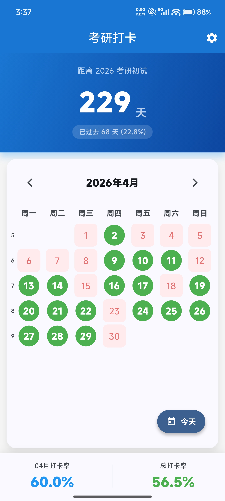
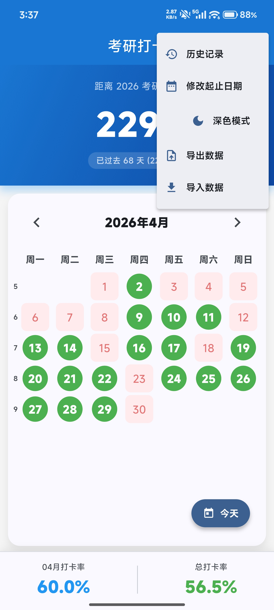
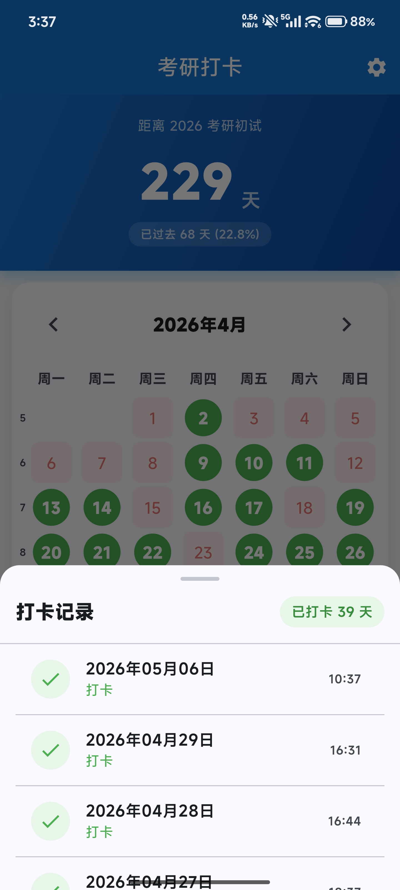
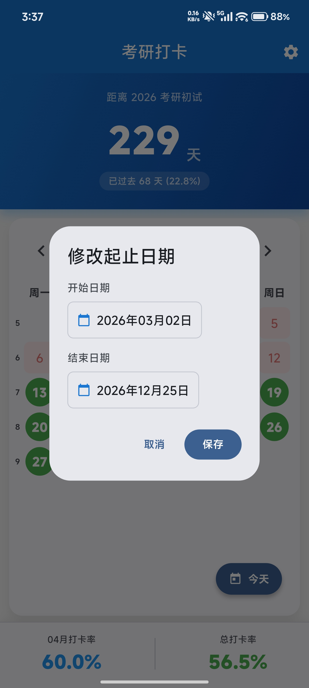
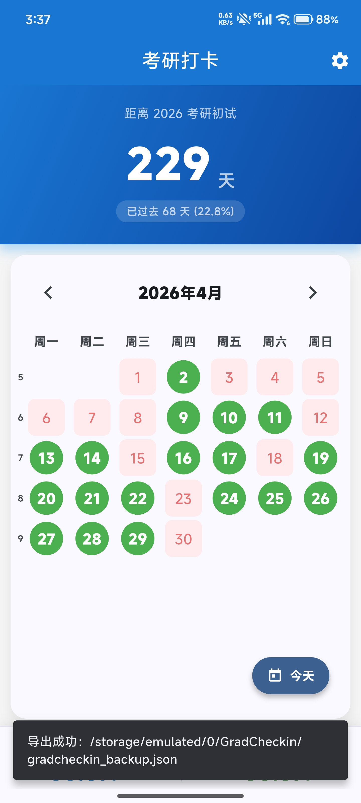
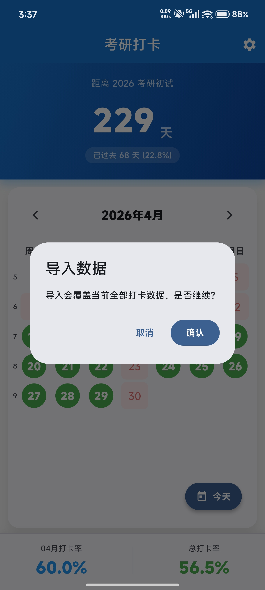
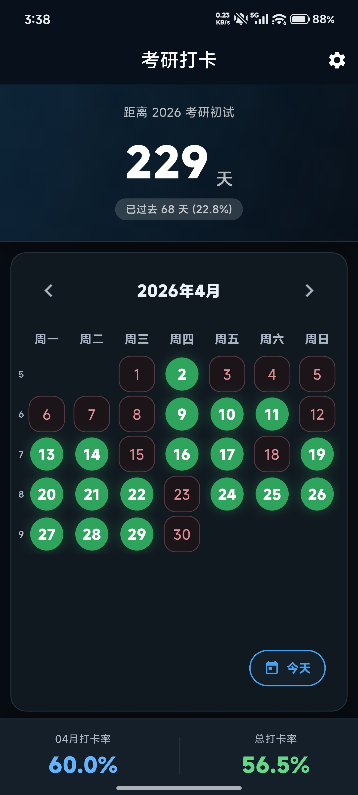

# gradcheckin

考研打卡APP

## Getting Started

This project is a starting point for a Flutter application.

A few resources to get you started if this is your first Flutter project:

- [Learn Flutter](https://docs.flutter.dev/get-started/learn-flutter)
- [Write your first Flutter app](https://docs.flutter.dev/get-started/codelab)
- [Flutter learning resources](https://docs.flutter.dev/reference/learning-resources)

For help getting started with Flutter development, view the
[online documentation](https://docs.flutter.dev/), which offers tutorials,
samples, guidance on mobile development, and a full API reference.

该项目开始由codebuddy实现，后面改成claude code继续完成，claude code接入的是智普的GLM大模型。因为功能简单，国内模型实现起来很轻松。

## 功能预览 ✨

首页： 

设置菜单：

打卡记录：

修改起止日期：

导出：

导入：

深色模式：

